# Aplikasi Pengelolaan Data KTP (CRUD Spring Boot & AJAX)

Proyek ini adalah tugas Full-Stack Web Application untuk mengelola data Kartu Tanda Penduduk (KTP). Aplikasi ini dibangun menggunakan Spring Boot untuk *backend* (REST API) dan HTML/CSS/JQuery AJAX untuk *frontend*.

## 🚀 Cara Menjalankan Aplikasi
1. Nyalakan server MySQL.
2. Buat database baru di MySQL dengan perintah: `CREATE DATABASE spring;`
3. Sesuaikan *username* dan *password* database di `src/main/resources/application.properties`.
4. Jalankan aplikasi melalui *main class* `Meet3Application.java`.
5. Akses web di browser: **`http://localhost:8080`**

---

## 📸 Dokumentasi & Screenshot Pengujian

Bagian ini mendemonstrasikan fungsionalitas CRUD (Create, Read, Update, Delete) yang berjalan sempurna baik dari sisi *database*, *frontend* (Web UI), maupun *backend* (API via Postman).

### 🗄️ 1. Database Schema
Tabel KTP otomatis di- *generate* oleh Spring Data JPA (Hibernate) ketika aplikasi dijalankan.
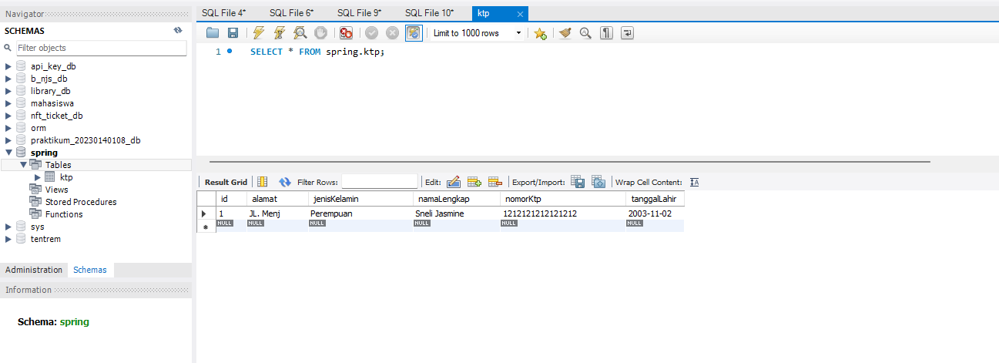

---

### 🌐 2. Pengujian Tampilan Web (Frontend UI)
Pengujian antarmuka pengguna berbasis HTML dan JQuery AJAX. Semua proses berjalan secara dinamis tanpa me-*refresh* halaman web.

#### A. Tambah Data (Create)
Berfungsi untuk menyimpan data KTP baru melalui form yang tersedia.
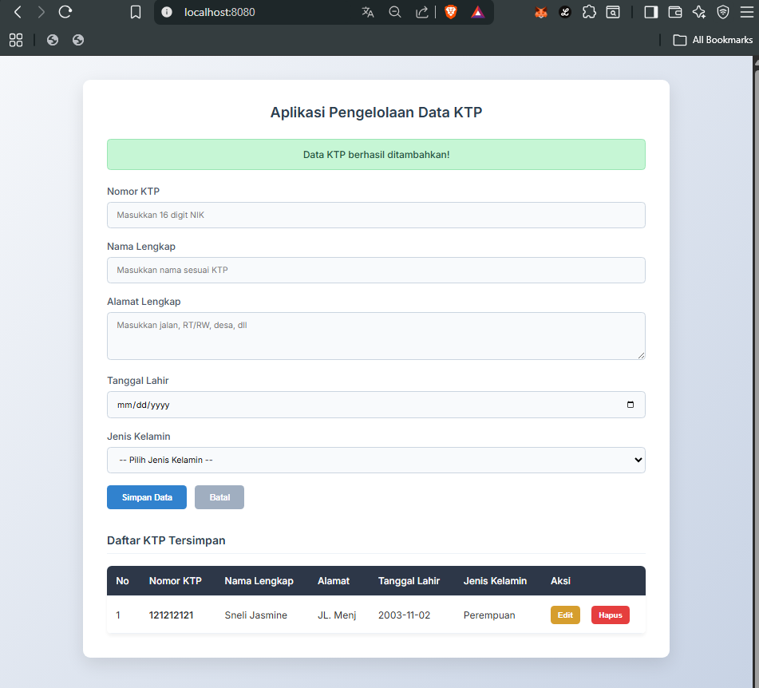

#### B. Ubah Data (Update)
Mengambil data ke dalam form dan memperbarui data KTP yang sudah ada di database.
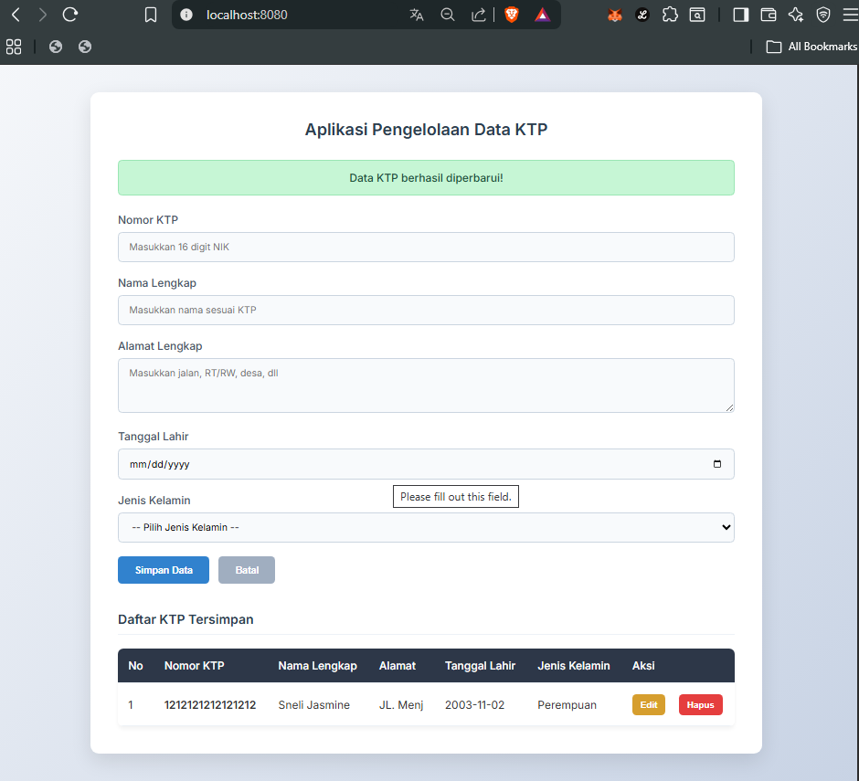

#### C. Hapus Data (Delete)
Menghapus data spesifik dari tabel KTP dengan *pop-up* konfirmasi terlebih dahulu.
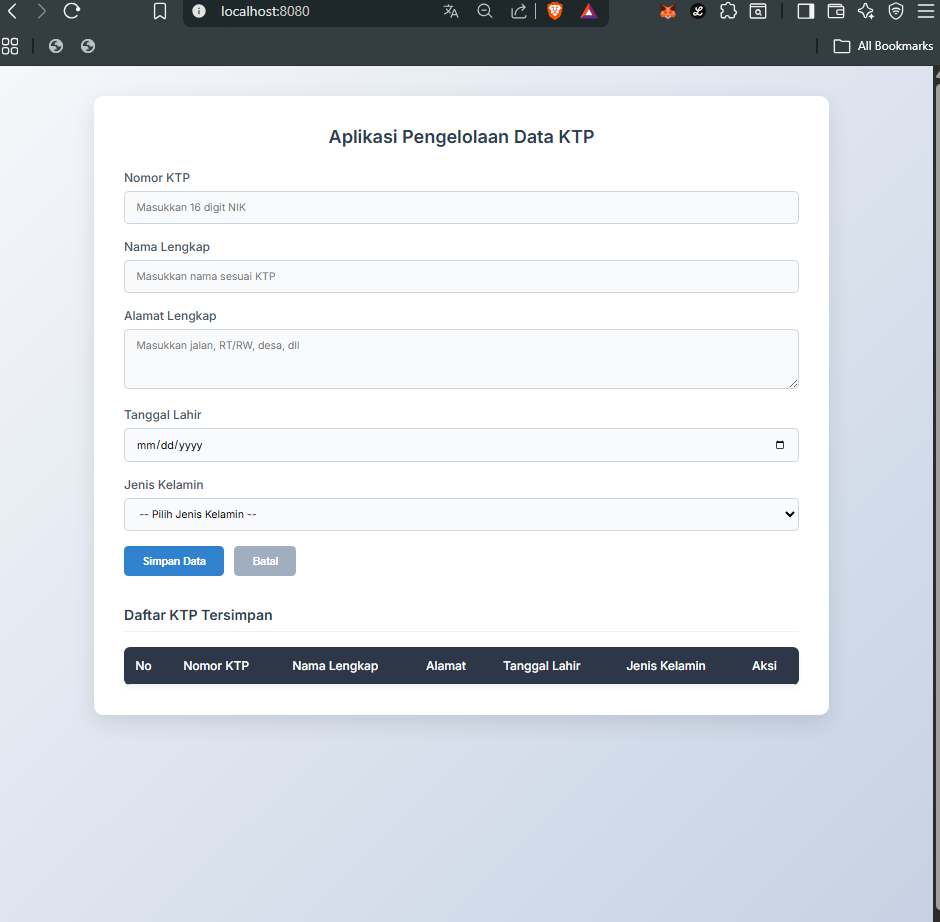

#### D. Validasi & Error Handling
Menampilkan notifikasi *error* (warna merah) apabila pengguna memasukkan NIK yang duplikat atau data yang tidak valid.
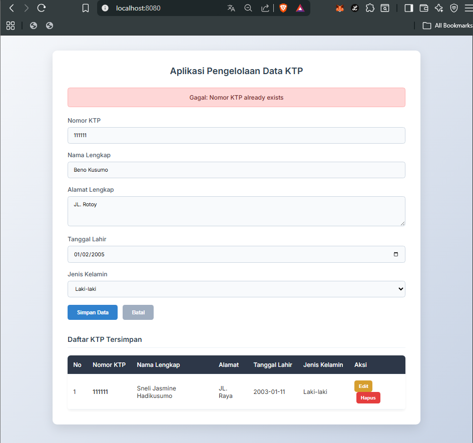

---

### ⚙️ 3. Pengujian REST API (Postman)
Pengujian *endpoint* backend secara langsung menggunakan Postman untuk memastikan HTTP Method dan respons JSON sesuai standar REST.

#### A. CREATE (POST /ktp)
Mengirimkan JSON *body* untuk menyimpan data KTP baru ke dalam database.
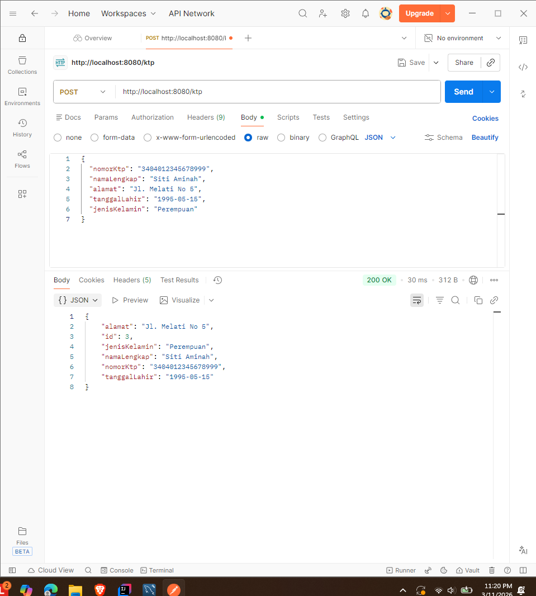

#### B. READ ALL (GET /ktp)
Mengambil seluruh daftar data KTP yang tersimpan di dalam database dalam bentuk Array JSON.
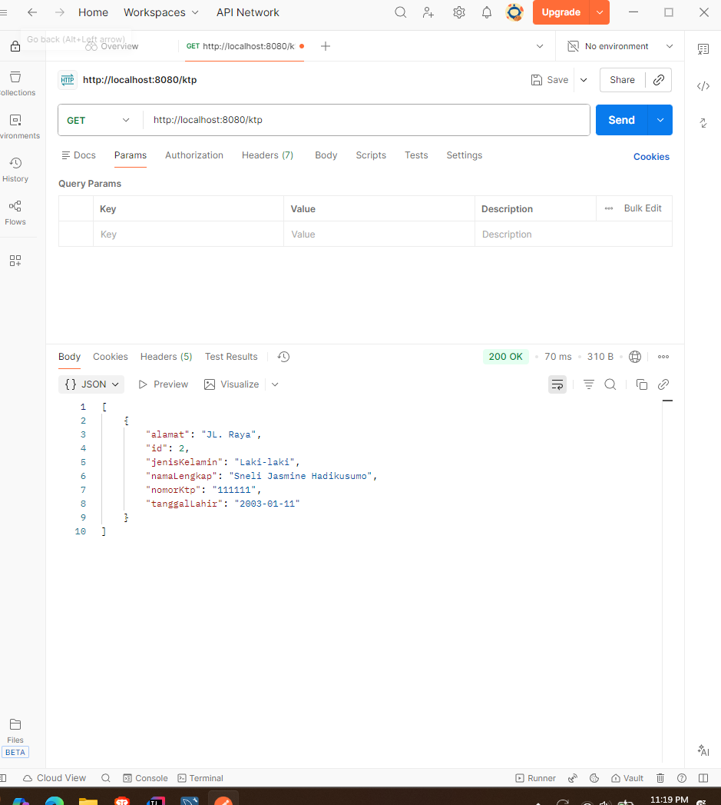

#### C. READ BY ID (GET /ktp/{id})
Mengambil satu data spesifik KTP berdasarkan parameter ID.
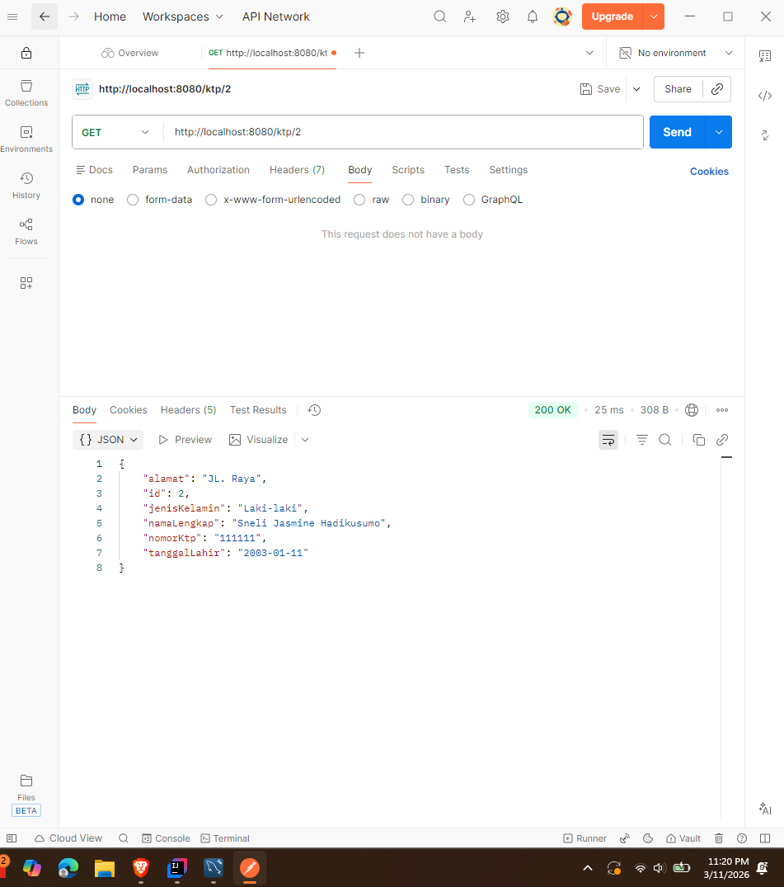

#### D. UPDATE (PUT /ktp/{id})
Memperbarui data KTP spesifik dengan mengirimkan JSON *body* yang baru.
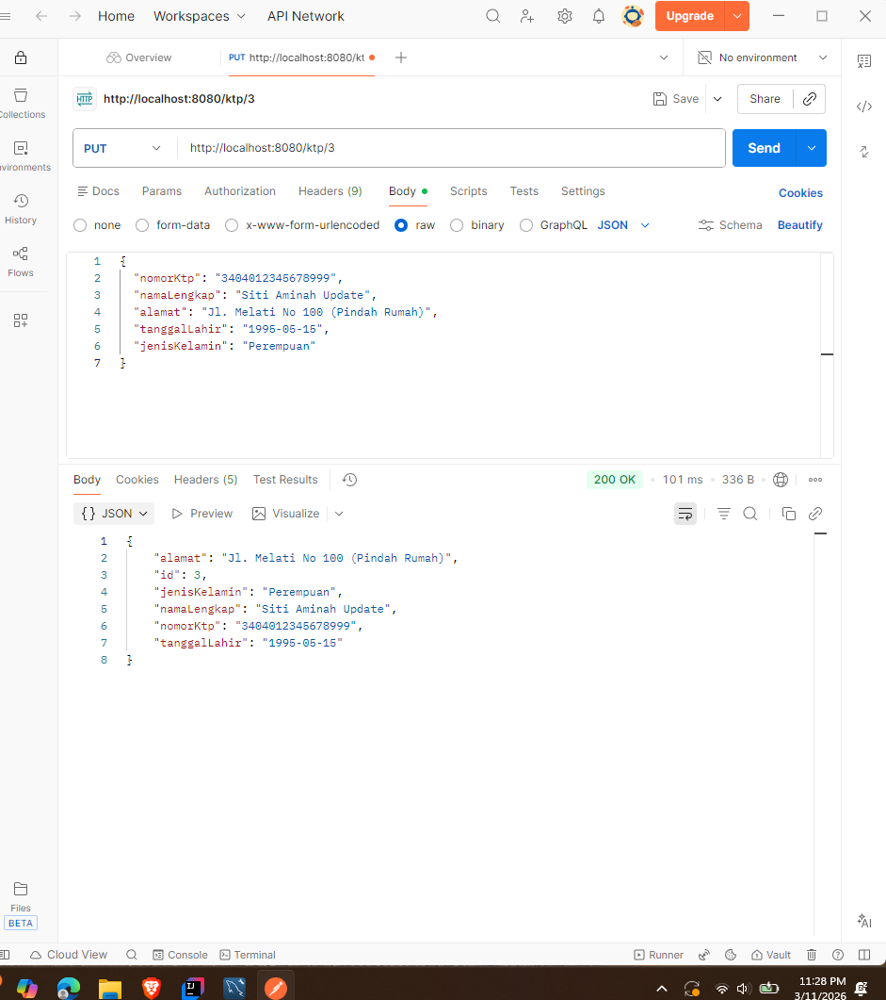

#### E. DELETE (DELETE /ktp/{id})
Menghapus record data KTP berdasarkan parameter ID dengan respons status `200 OK`.
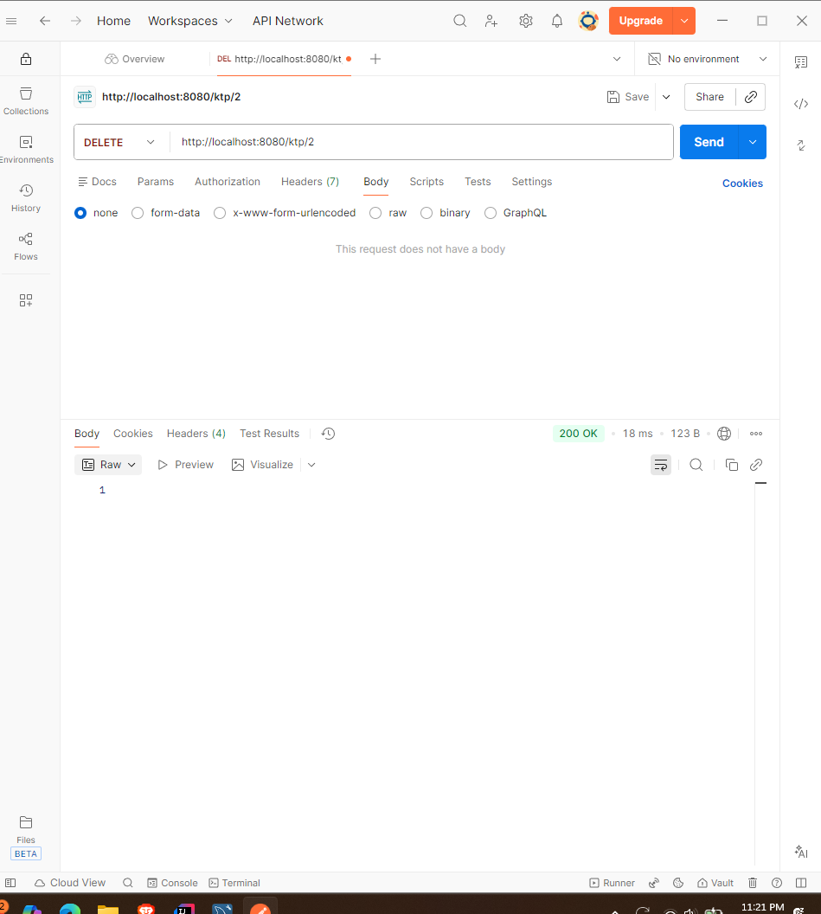

#### F. ERROR HANDLING (400 Bad Request)
Menangani *exception* (seperti nomor KTP sudah terdaftar atau KTP tidak ditemukan) dan mengembalikan respons *error* JSON yang bersih, bukan *stack trace*.
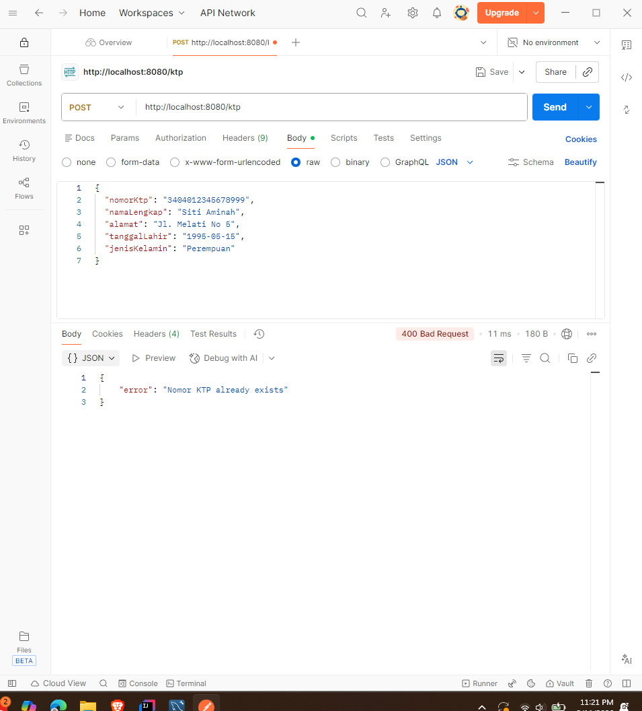
